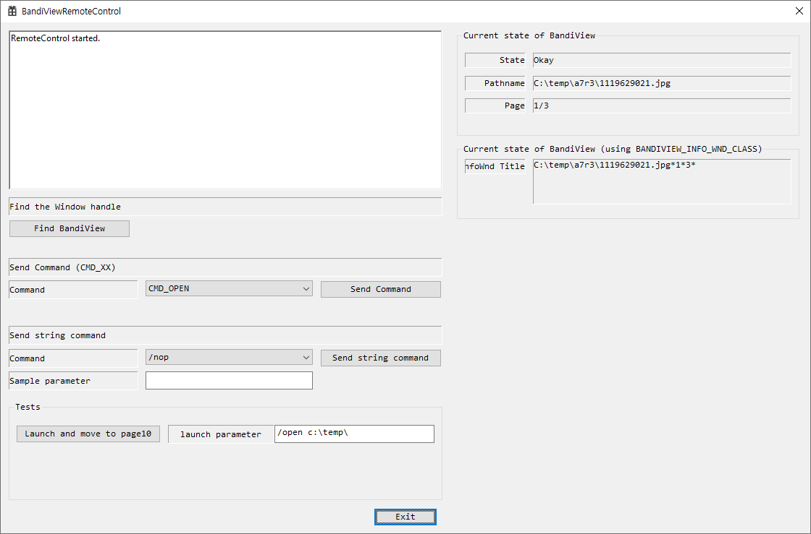

# BandiViewRemocon

* Sample remote control program to control BandiView remotely.
* Win32/C++

## How to control BandiView

1. Send WM_COMMAND directly to BandiView

   1. Find the window handle of BandiView
   2. Send WM_COMMAND with CMD_XX
   3. CMD_XX can be found in C:\Program Files\BandiView\data\resource.data

   * For example
     * CMD_OPEN
     * CMD_PAGE_NEXT
     * CMD_PAGE_PREV
2. Send String Command to BandiView with WM_COPYDATA

   1. Find the window handle of BandiView
   2. Send string command to BandiView (See SendStringCommand2BandiView())
   3. You can send any of the command line parameters listed here. (https://www.bandisoft.com/bandiview/help/command-line-parameter/)

   * For example
     * /open c:/image.jpg
     * /move2page 10
3. Use BandiViewRemoteControl.x64.exe to send your command-line command to BandiView

   * Simply run BandiViewRemoteControl.x64.exe to send the command line.
   * For example

     * BandiViewRemoteControl.x64.exe /open c:/photos/
     * BandiViewRemoteControl.x64.exe /move2page 10

## How to retrieve the current state of BandiView

1. Use a memory mapped file.

   * Open the existing memory mapped file ("BandiViewDebugInfo") and retrieve the "BandiViewState" struct.
   * Please check the function RetriveCurrentBandiViewState()
2. Use FindWindow() and GetWindowText()

   1. Find the info window (class name = "BANDIVIEW_INFO_WND_CLASS")
   2. Get the title of the window

   * The window text contains this information.
     * `<current path name of the image file>`*``<second filepathname if exists>`*`<current page num>*<total page num>*`
     * For example: `c:\temp\test.zip|abc.jpg**10*100*`

